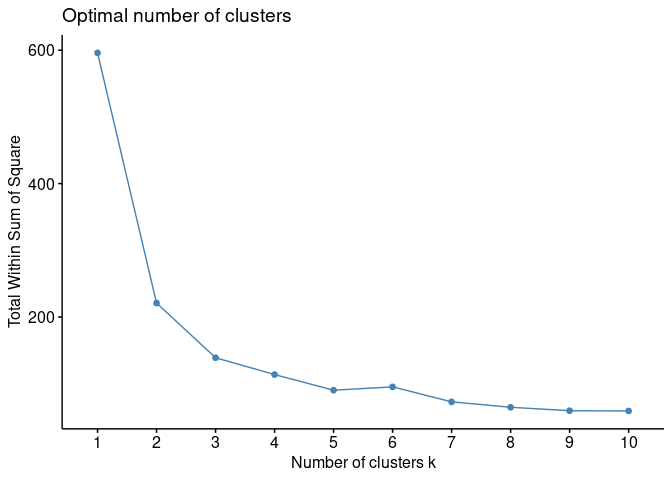

K-means clustering example
================
Andrew Tolonen
june 2024

# References

<https://www.youtube.com/watch?v=NKQpVU1LTm8>

# Introduction

K-means is an unsupervised clustering method that groups observations
into a user-defined number of clusters. It is an iterative method
whereby K centroids are placed in the data space and each data point is
assigned to the nearest cluster based on Euclidean distance. The
centroids are then moved to the centers of the new clusters and the
observations are reassigned. This process is iterated until either the
centroids no longer move or the number of iterations are reached.

# Methods

## 1. Setup and file I/O

``` r
library(factoextra); #  functions to extract and visualize the output of multivariate data analyses (PCA)
library(tidyverse);

rm(list = ls());
```

## 2. Euclidean distances of normalized data

``` r
# iris data set: 150 obs of 5 variables: sepal length, sepal width, petal length, petal width, species
iris_labels = iris$Species; # save labels 
iris_data = select(iris, -Species); # remove non-numeric species variable

# scale each column into z-scores (mean = 0, sd = 1). normalize for distance matrix.
iris_data_sc = scale(iris_data); 

# calc euclidean dist between each of 150 obs: yields 150x150 distance matrix
iris.dist = factoextra::get_dist(iris_data_sc, method="euclidean");
```

## 3. Elbow plot to select number of cluster

The elbow method involves finding the optimal k via a graphical
representation. It works by finding the within-cluster sum of square
(wss), i.e. the sum of the square distance between points in a cluster
and the cluster centroid.

``` r
# wss = total within sum of square.
factoextra::fviz_nbclust(iris_data_sc, kmeans, method = "wss");
```

<!-- -->

## 4. Perform K-means clustering

``` r
# set seed for reproducibility
set.seed(86);

# k-means
km.out = kmeans(iris_data_sc, centers = 3, nstart = 100);
```

## 3. Visualize data as clusters

``` r
# get cluster membership of each point
km.clusters = km.out$cluster; 

# add unique species label to normalized data
uniquenames = paste(iris$Species, 1:length(iris$Species), sep = "_");
rownames(iris_data_sc) = uniquenames;

# plot clusters. Observations are represented by points in the plot, using principal components if ncol(data) > 2. An ellipse is drawn around each cluster.
fviz_cluster(list(data = iris_data_sc, cluster = km.clusters))
```

<!-- -->

## 4. Table showing how well clusters correspond with species

``` r
# contingency table showing the number of each species in each cluster
table(km.clusters, iris$Species); # count the number of species in each cluster
```

    ##            
    ## km.clusters setosa versicolor virginica
    ##           1      0         39        14
    ##           2     50          0         0
    ##           3      0         11        36
