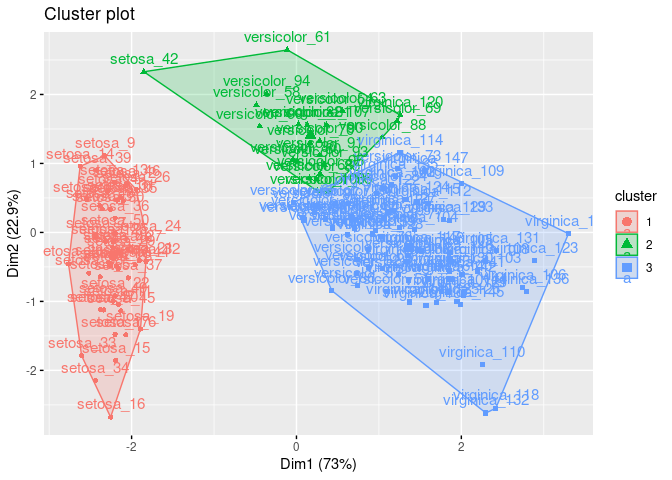

Hierarchial clustering example
================
Andrew Tolonen
apr22

# References

<https://www.youtube.com/watch?v=MAUs4484TG8>

# Introduction

- Hierarchial clustering = unsupervised learning. It is a K-means
  alternative that does not require specifying number of clusters.

- Clustering can be top-down or bottom-up (agglomerative, AGNES)

- Distance metrics

1.  Euclidean
2.  Manhattan
3.  Max distance

# Methods

## 1. Setup and file I/O

``` r
library(factoextra); # includes functions to extract and visualize the output of multivariate data analyses (PCA)
library(tidyverse);

rm(list = ls());
```

## 2. Clustering

``` r
# iris data set: 150 obs of 5 variables: sepal length, sepal width, petal length, petal width, species
iris_data = select(iris, -Species); # remove non-numeric variable

# scale each column into z-scores (mean = 0, sd = 1). normalize for distance matrix.
iris_data_sc = scale(iris_data); 

# calc euclidean dist between each of 150 obs: yields 150x150 distance matrix
iris.dist = dist(iris_data_sc, method="euclidean");

# hierarchial clustering
iris.clust = hclust(iris.dist, method="complete");
```

## 3. Visualize data as dendrogram

``` r
# plot dendrogram
iris.plot = plot(iris.clust);

# draw rectangular diagram around clusters
rect.hclust(iris.clust, k=3, border=2:5);
```

<!-- -->

## 3. Visualize data as clusters

``` r
# cut tree into clusters. output=vector assigning each obs to a cluster
iris.cutree = cutree(iris.clust, k=3);

# add unique row names to each obs containing species info
rownames(iris_data_sc) = paste(iris$Species, 1:dim(iris)[1], sep ="_");

# visualize clusters
# provides ggplot2 visualization. Observations are represented by # # points in the plot, using principal components if ncol(data) > 2. An # ellipse is drawn around each cluster.

# arguments are data to be clustered, and cluster membership.
iris.clust.plot = fviz_cluster(list(data=iris_data_sc, cluster = iris.cutree));

iris.clust.plot
```

<!-- -->

## 4. Table

``` r
# frequency table showing the number of each species in each cluster
table.out = table(iris.cutree, iris$Species);

table.out
```

    ##            
    ## iris.cutree setosa versicolor virginica
    ##           1     49          0         0
    ##           2      1         21         2
    ##           3      0         29        48
