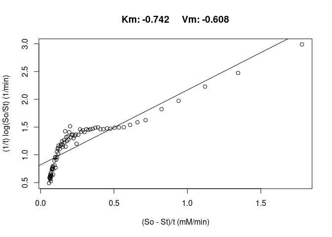
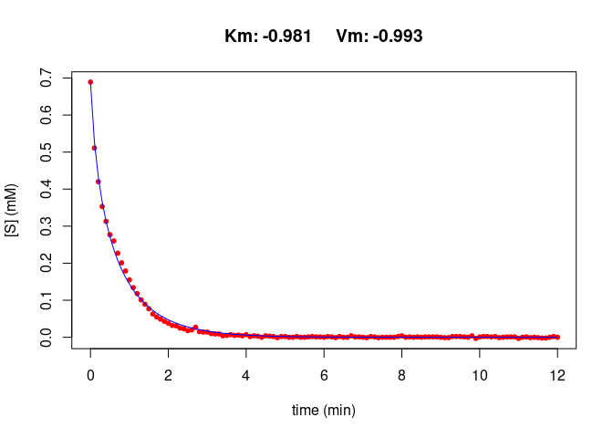
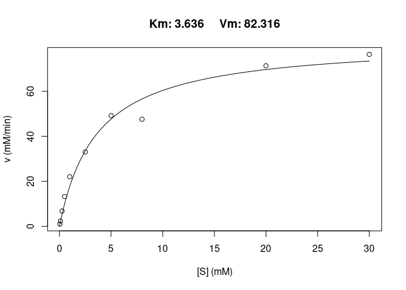
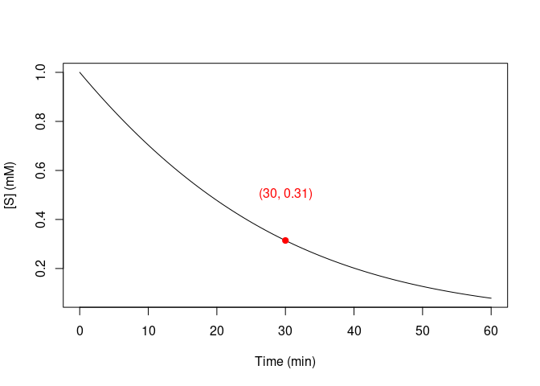

renz methods
================
Andrew Tolonen
2024

- [Introduction](#introduction)
- [Setup](#setup)
- [renz functions](#renz-functions)
  - [fE.progress()](#feprogress)
  - [dir.MM()](#dirmm)
  - [Lineweaver-Burke: linear
    regression](#lineweaver-burke-linear-regression)
  - [Lineweaver-Burke: weighted linear
    regreassion](#lineweaver-burke-weighted-linear-regreassion)
  - [se.Progress()](#seprogress)

# Introduction

The goal of this notebook is to illustrate the methods provided with the
renz package to calculate enzyme parameters: vmax and km.

# Setup

``` r
rm(list = ls());

library(knitr);
library(tidyverse);
```

    ## ── Attaching core tidyverse packages ──────────────────────── tidyverse 2.0.0 ──
    ## ✔ dplyr     1.1.4     ✔ readr     2.1.5
    ## ✔ forcats   1.0.0     ✔ stringr   1.5.1
    ## ✔ ggplot2   3.5.0     ✔ tibble    3.2.1
    ## ✔ lubridate 1.9.3     ✔ tidyr     1.3.1
    ## ✔ purrr     1.0.2     
    ## ── Conflicts ────────────────────────────────────────── tidyverse_conflicts() ──
    ## ✖ dplyr::filter() masks stats::filter()
    ## ✖ dplyr::lag()    masks stats::lag()
    ## ℹ Use the conflicted package (<http://conflicted.r-lib.org/>) to force all conflicts to become errors

``` r
library(renz);
library(readxl);
```

``` r
# HTML
knitr::opts_chunk$set(warning = F, message = F);
```

# renz functions

## fE.progress()

fE.progress() enables us to calculate Km, Vmax directly from a single
curve of substrate versus time.

``` r
# fE.progress, which makes use of the Schnell-Mendoza equation, allows us to obtain, from one single progress curve, the kinetic parameters of the enzyme.

# load reaction data
datafile = "/home/tolonen/Github/actolonen/Public/Analysis_Lab/Enzyme_Kinetics/reactionRate.xlsx";
mydata = read_excel(datafile, sheet = "Rate", col_names = TRUE, skip = 0);

mydata = as.data.frame(mydata); 
output = fE.progress(mydata)
```

<!-- -->

    ## 0.01185121  (1.39e+00): par = (-0.742 -0.608)
    ## 0.004461124 (4.09e-01): par = (-0.8875759 -0.8455525)
    ## 0.003807527 (7.04e-02): par = (-0.9634881 -0.9666399)
    ## 0.003787590 (6.44e-03): par = (-0.9794919 -0.9910865)
    ## 0.003787422 (4.64e-04): par = (-0.9808925 -0.9931228)
    ## 0.003787421 (3.27e-05): par = (-0.9809979 -0.9932789)
    ## 0.003787421 (2.27e-06): par = (-0.9810052 -0.9932895)

<!-- -->

## dir.MM()

calculate Km and Vmax from substrate versus velocity curves

``` r
data(ONPG, package = "renz"); # load ONPG data

# Calc mean velocity of ONPG dataset
ONPG.data = ONPG %>%
  pivot_longer(cols = v1:v8, names_to = "Students", values_to = "Velocity");

ONPG.data = ONPG.data %>%
  select(ONPG, Velocity) %>%
  group_by(ONPG) %>%
  summarize(Velocity.mean = mean(Velocity));
  
dir.MM(ONPG.data, unit_v = "mM/min")
```

<!-- -->

    ## $parameters
    ##     Km     Vm 
    ##  3.636 82.316 
    ## 
    ## $data
    ## # A tibble: 10 × 3
    ##        S     v fitted_v
    ##    <dbl> <dbl>    <dbl>
    ##  1  0.05  1.04     1.12
    ##  2  0.1   2.40     2.20
    ##  3  0.25  6.84     5.30
    ##  4  0.5  13.3      9.95
    ##  5  1    22.0     17.8 
    ##  6  2.5  33.0     33.5 
    ##  7  5    49.2     47.7 
    ##  8  8    47.6     56.6 
    ##  9 20    71.3     69.7 
    ## 10 30    76.4     73.4

## Lineweaver-Burke: linear regression

``` r
# Lineweaver-burke enables the calculation of Km and Vmax. Input data is the initial
# reaction velocity (V0) at various initial substrate concentrations (Vinitial vs Sinitial)

data(ONPG, package = "renz"); # load ONPG data
ONPG[ , 4:7] <- 1000 * ONPG[ , 4:7]; # put all data on same scale

ONPG.data = ONPG %>%
  pivot_longer(cols = v1:v8, names_to = "Student", values_to = "Rate");

# check data looks OK
p1=ggplot(ONPG.data, aes(x=ONPG, y=Rate))+
  geom_point(size = 2)+
  xlab("Substrate")+
  ylab("Velocity")+
  facet_wrap(~Student)+
  theme_classic();
     
# Method 1: linear regression of sample means   
# get mean rate
ONPG.lineweaver = ONPG.data %>%
  group_by(ONPG) %>%
  reframe(Rate.mean = mean(Rate),
                             ONPG.inverse = 1/ONPG,
                             Rate.inverse = 1/Rate.mean) %>%
  distinct();

# fit linear model
lm.lin = lm(Rate.inverse ~ ONPG.inverse, ONPG.lineweaver);

# calc regression line
yintercept = lm.lin$coefficients[1];
myslope = lm.lin$coefficients[2];
Rate.inverse.calc = myslope * ONPG.lineweaver$ONPG.inverse + yintercept;
temp = data.frame(Rate.inverse.calc = Rate.inverse.calc)
ONPG.lineweaver = cbind(ONPG.lineweaver, temp);

# calc Vmax and Km
Vmax = 1/yintercept;
Km = Vmax * myslope;
text.out = paste("Vmax = ", round(Vmax, 2), " Km = ", round(Km, 2), sep = "");

# plot data (red points) and regression line (black line)
p3 = ggplot(ONPG.lineweaver, aes(x=ONPG.inverse, y=Rate.inverse)) +
 ggtitle("Data and linear regression line")+
 geom_point(size=1, color = "red") +
 xlab("1/Substrate") +
 ylab("1/Velocity") +
 geom_line(aes(x=ONPG.inverse, y=Rate.inverse.calc))+
 geom_text(x=10, y=0.1, label=text.out)+
 theme_classic();

p3
```

<!-- -->

## Lineweaver-Burke: weighted linear regreassion

``` r
# Method 2: calc weighted linear regression for each sample, then take means
Km.all = numeric(0);
Vmax.all = numeric(0);
for (i in 2:9)
{
  wg = lb(ONPG[ , c(1,i)], weighting = TRUE);
  Km.all[i] = wg$fitted_parameters[1];
  Vmax.all[i] = wg$fitted_parameters[2];
}
```

<!-- --><!-- --><!-- --><!-- --><!-- --><!-- --><!-- --><!-- -->

``` r
Km.calc = mean(na.omit(Km.all));
Vmax.calc = mean(na.omit(Vmax.all));
```

## se.Progress()

Calculate substrate consumption curve when given Km, Vmax, initial
substrate

``` r
# Enzyme parameters
So.test = 1;
time.test = 60;
Km.test = 2;
Vmax.test = 0.1;

data = sE.progress(So = So.test, time = time.test, Km = Km.test, Vm = Vmax.test, plot = FALSE)

# plot Substrate as a function of time
plot(data$t, data$St, ty = 'l', xlab = "Time (min)", ylab = "[S] (mM)")

# add red point when t = 30
points(data$t[which(data$t == 30)], data$St[which(data$t == 30)], pch = 19, col = "red")

# add text to point
text(30, 0.5, paste("(30, ", round(data$St[which(data$t == 30)], 2), ")", sep = ""), col = "red")
```

<!-- -->
