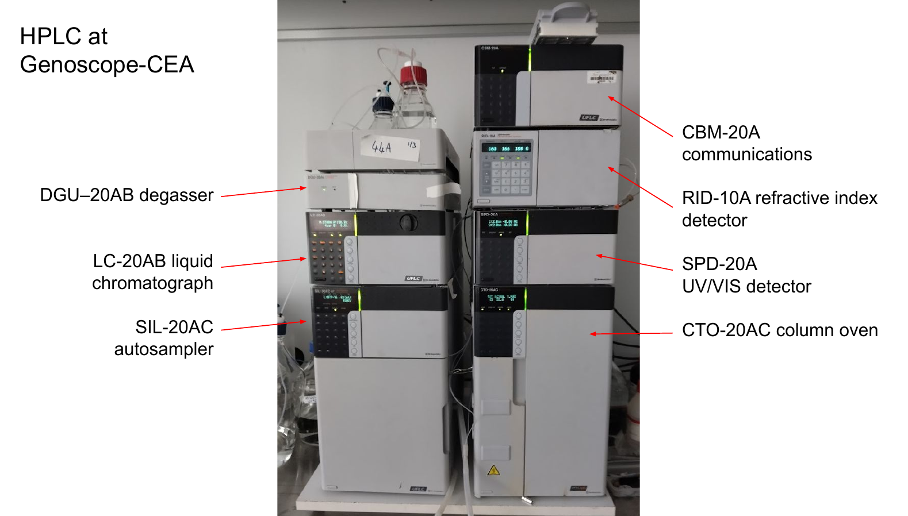

# HPLC at Genoscope-CEA

Here is an image of the Shimadzu HPLC at the Genoscope-CEA

## Manuals

-   [Column oven (CTO-20A)](Manuals/CTO-20A_IM_EN.pdf)
-   [Liquid chromatograph (LC-20AB)](Manuals/LC-20AB_IM_EN.pdf)
-   [Autosampler (SIL-20AC)](Manuals/SIL_20A_IM_VerA_ocr_EN.pdf)
-   [UV-VIS detector (SPD-20A)](Manuals/SPD-20A20AV_IM_EN.pdf)
-   [RID detector (RID-10A)](Manuals/rid10a.pdf)

-   [Aminex HPX-87H column](Manuals/LIT42D.PDF)

## Experimental procedure

-   Here is [Tom's protocol](Protocols/2024.09_protocolHPLC.pdf) to run the HPLC.
-   Here is [Magali's protocol](Protocols/2024.10_protocole_HPLC_MB.docx) to run the HPLC.

## HPLC Troubleshooting

-   [Protocol](Protocols/RID-10A_IM_UsersManual_Rev0.pdf) to clean the lines with nitric acid and organic solvent.

## Compound detection by HPLC

**Compound detection**: our HPLC has 3 detectors: refractive index (RID), UV 210 nm, and UV 260 nm. Different compounds can be detected with the detectors. The table below shows peak elution times for each compound.

| Compound | Type | RID | UV 210 nm | UV 260 nm |
|:----------------:|:----------------:|-----------------:|-----------------:|-----------------:|
| Lactate | Acid | 15.5 | 15.5  | none |
| Formate | Acid | 16.8 | 16.8 | none |
| Acetate | Acid | 18.25 | 18.25 | none |
| Propionate | Acid | 21 | 21  | none |
| Butyrate | Acid | 25.5 | 25.5 | none |
| Ethanol | Alcohol | 26 | none | none |
| 1-Propanol | Alcohol | 33.5 | none | none |
| 1-Butanol | Alcohol | 45 | none | none |
| Acetone | Ketone | 26.4 | none | 26.4 |
| Glucose | Sugar | 11.2 | none | none |
